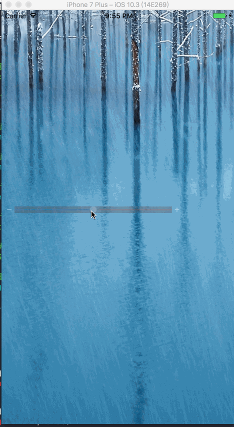
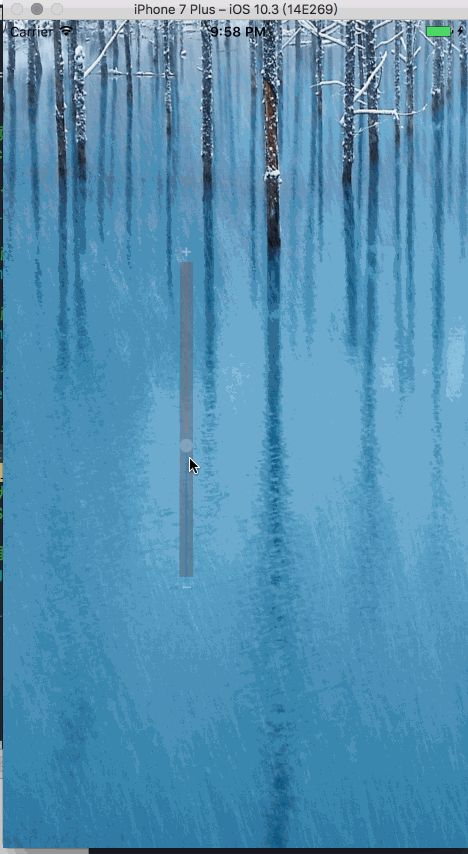

# DDLucencySlider

## 一、前言

项目中经常会遇到要自定义slider，而通常意义上的自定义一般的有两种：

```
1.继承于系统的UISlider，对原生的基础上做一些界面及功能上的更改；

2.用原生的UIView来实现类似于UISlider的界面及功能；
```

## 二、正文
当然小白今天想要介绍的是自己项目中遇到的需求，当然有些奇葩，直接上图先， 有图有真相：

*水平方向*



*垂直方向*



###.DDLucencySlider的特点：
```
1.1.Thumb旁边有一个透明间隔随着Thumb的运动跟着运动, 随着Thumb的向左运动，透明间隔跟随在其后； Thumb向右运动，透明间隔跟随在前面运动，当向右运动到小于透明间距的时候，透明间隔逐渐变短，至消失；

1.2.SliderView整体有长按效果；

1.3.SliderView可以水平垂直旋转；

```

## 三、使用方式
	//sliderView的背景颜色
	ddSliderView.backgroundColor   = UIColor.clear     

    //slider本身的背景颜色
    ddSliderView.ddSlider.backgroundColor = UIColor.darkGray
        
    //slider最小值路径的颜色
    ddSliderView.minimumTrackColor   = UIColor.blue
        
    //slider最大值路径的颜色
    ddSliderView.maximumTrackColor   = UIColor.red
        
    //slider当前的值，默认整体为1.0
    ddSliderView.value               = 0.5
        
    //slider旋转角度，默认为水平方向，**建议水平垂直方向旋转
    ddSliderView.rotateAngle       = -M_PI_2
        
    //sliderView整体的状态normal及LongPress状态
    //ddSliderView.ddSliderViewState = .LongPress
        
## 四、尾声
DDLucencySlider属于比较特别的一种需求，更多的是提供一种解决此类需求的一种思路。


